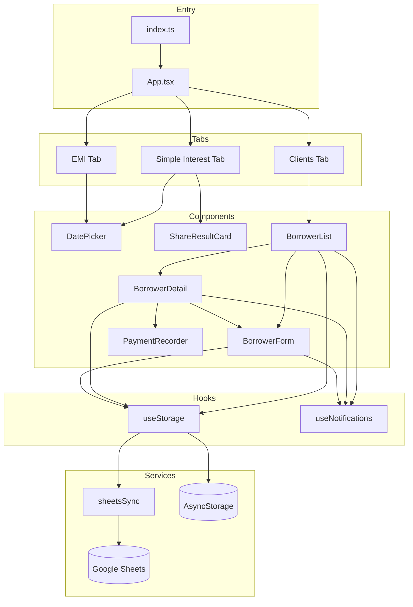

# Simple Interest Calculator

A React Native (Expo) mobile app for calculating simple interest, generating EMI schedules, and managing borrower/client profiles with optional Google Sheets sync.

## Features

| Tab | Description |
|-----|-------------|
| **Simple** | Calculate simple interest over a date range and share results as an image |
| **EMI** | Generate monthly EMI schedules in *Cutting* or *Adding* mode |
| **Clients** | Manage borrower profiles, loans, payment tracking, and CSV export |

---

## Quick Setup

### Prerequisites

- Node.js 18+
- npm or yarn
- [Expo Go](https://expo.dev/go) on your phone, or Android Studio / Xcode for emulators

### Install & Run

```bash
# Clone and enter the project
cd SimpleInterestCalculator

# Install dependencies
npm install

# Start the Expo dev server
npm start
```

Then press `a` for Android, `i` for iOS, or scan the QR code with Expo Go.

### Optional: Google Sheets Sync

1. Follow [docs/GOOGLE_SHEETS_APPS_SCRIPT.md](./docs/GOOGLE_SHEETS_APPS_SCRIPT.md) to deploy the Apps Script web app.
2. Set the deployed URL in `app.json` under `expo.extra.sheetsWebappUrl`:

```json
{
  "expo": {
    "extra": {
      "sheetsWebappUrl": "https://script.google.com/macros/s/YOUR_DEPLOYMENT_ID/exec"
    }
  }
}
```

3. Restart the Expo dev server (`npm start`).

The app reads this URL at startup in `App.tsx` and assigns it to `globalThis.SHEETS_WEBAPP_URL`.

### Build for Production (EAS)

```bash
npx eas build --platform android   # or ios
```

Project ID is configured in `app.json` → `extra.eas.projectId` and `eas.json`.

---

## Project Structure

```
SimpleInterestCalculator/
├── App.tsx                    # Root app: tabs, Simple/EMI calculators
├── index.ts                   # Expo entry point
├── app.json                   # Expo config (Sheets URL, package name)
├── eas.json                   # EAS Build profiles
├── src/
│   ├── types.ts               # Shared TypeScript interfaces
│   ├── screens/
│   │   ├── BorrowerList.tsx       # Client list, search, navigation hub
│   │   └── BorrowerDetail.tsx     # Single borrower: loans, payments, export
│   ├── components/
│   │   ├── BorrowerForm.tsx    # Create/edit borrower + optional loan
│   │   ├── PaymentRecorder.tsx # Modal to record installment payments
│   │   ├── DatePicker.tsx      # Cross-platform date picker
│   │   └── ShareResultCard.tsx # Shareable simple-interest result card
│   ├── hooks/
│   │   ├── useStorage.ts       # AsyncStorage CRUD + Sheets sync
│   │   └── useNotifications.ts # Payment reminder stub (no-op)
│   └── services/
│       └── sheetsSync.ts       # Google Sheets web app HTTP client
└── docs/
    └── GOOGLE_SHEETS_APPS_SCRIPT.md
```

---

## Architecture Overview



---

## File Reference

### Entry & Config

| File | Purpose | Called By |
|------|---------|-----------|
| `index.ts` | Registers `App` with Expo via `registerRootComponent` | Expo runtime |
| `app.json` | App metadata, Android package, `sheetsWebappUrl` | Expo / EAS |
| `eas.json` | EAS Build configuration | `eas build` CLI |
| `src/types.ts` | `Borrower`, `Loan`, `Payment` interfaces | All client-related modules |

---

### `App.tsx` — Root Application

**Role:** Main shell with three tabs (Simple, EMI, Clients). Contains interest calculation logic for the calculator tabs.

| Export / Symbol | Description | Used In |
|-----------------|-------------|---------|
| `CalculationResult` | Interface for simple interest output | `ShareResultCard` |
| `EMIRow` | Single row in EMI schedule table | Internal to `App.tsx` |
| `daysBetween()` | Inclusive day count between two dates | `handleCalculate` |
| `calculateSimpleInterest()` | Formula: `(P × R × days) / 3000` | `handleCalculate` |
| `addMonths()` | Advance a date by N months | EMI schedule generation |
| `formatDate()` / `formatCurrency()` | Display helpers | EMI table, readonly fields |
| `App` (default) | Tab navigation + calculator UI | `index.ts` |

**Component usage in `App.tsx`:**

- `DatePicker` — start/end dates (Simple tab), EMI start date
- `ShareResultCard` — shown after Simple interest calculation
- `BorrowerList` — entire Clients tab content

**Sheets config:** Reads `expo.extra.sheetsWebappUrl` from `Constants` and sets `globalThis.SHEETS_WEBAPP_URL`.

---

### Components

#### `src/components/DatePicker.tsx`

**Role:** Reusable date input with platform-specific UI (Android inline picker, iOS modal with Done/Cancel).

| Props | Type | Description |
|-------|------|-------------|
| `label` | `string` | Field label |
| `value` | `Date \| null` | Selected date |
| `onChange` | `(date: Date) => void` | Callback on selection |
| `placeholder` | `string` | Shown when no date selected |

**Called from:**

- `App.tsx` — Simple & EMI date fields
- `BorrowerForm.tsx` — loan start date
- `PaymentRecorder.tsx` — payment date

---

#### `src/components/ShareResultCard.tsx`

**Role:** Renders a styled result card for simple interest and captures it as PNG for sharing via `expo-sharing`.

| Props | Description |
|-------|-------------|
| `result: CalculationResult` | Principal, rate, dates, days, interest |

**Called from:** `App.tsx` when `tab === 'simple'` and `result` is set.

**Dependencies:** `react-native-view-shot`, `expo-sharing`

---

#### `src/screens/BorrowerList.tsx`

**Role:** Client list hub — search, add, refresh from Sheets, delete, and navigate to detail/form views.

| Hook / Handler | Description |
|----------------|-------------|
| `useStorage()` | Loads/saves borrowers |
| `useNotifications()` | Cancels reminders on delete (stub) |
| `handleRefresh()` | Pulls data from Google Sheets via `refreshFromSheet` |
| `handleDelete()` | Confirms and removes borrower |

**Navigation flow:**

```
BorrowerList
  ├─ showForm → BorrowerForm (add/edit)
  └─ selected → BorrowerDetail
```

**Called from:** `App.tsx` when `tab === 'clients'`.

---

#### `src/screens/BorrowerDetail.tsx`

**Role:** Full borrower profile — summary stats, expandable loan cards, payment schedule tables, CSV export, payment recording.

| Handler | Description |
|---------|-------------|
| `handleDeleteLoan()` | Removes a loan, syncs to Sheets |
| `handleShareLoanStatement()` | Exports loan + payments as CSV via `expo-sharing` |
| `handlePaymentSave()` | Updates payment record, syncs borrower to Sheets |

**Called from:** `BorrowerList` when a borrower card is tapped.

**Child components:** `BorrowerForm` (add loan), `PaymentRecorder` (record payment modal)

---

#### `src/components/BorrowerForm.tsx`

**Role:** Create or edit a borrower profile; optionally attach a new loan with auto-generated payment schedule.

| Function | Description |
|----------|-------------|
| `generatePaymentSchedule()` | Builds `Payment[]` for Cutting or Adding EMI mode |
| `generateId()` | Unique ID for entities |
| `handleSave()` | Validates, builds `Borrower`, pushes to Sheets (`add_borrower`) |

| Props | Description |
|-------|-------------|
| `initial?` | Existing borrower for edit mode |
| `allowLoanFields?` | Show loan section when adding loan to existing client |
| `onSave` / `onCancel` | Callbacks |

**Called from:**

- `BorrowerList` — new client or edit
- `BorrowerDetail` — add loan (`allowLoanFields={true}`)

---

#### `src/components/PaymentRecorder.tsx`

**Role:** Bottom-sheet modal to record the next unpaid installment.

| Feature | Description |
|---------|-------------|
| Quick amount buttons | 25%, 50%, 100% of due |
| Delay calculation | Days late × daily rate × due amount |
| Partial payments | Tracks `remainingAmount` |

**Called from:** `BorrowerDetail` when "+ Record Payment" is tapped.

---

### Hooks

#### `src/hooks/useStorage.ts`

**Role:** Central data layer — persists borrowers to AsyncStorage and syncs with Google Sheets.

| Method | Description | Called From |
|--------|-------------|-------------|
| `borrowers` | In-memory borrower array | `BorrowerList`, `BorrowerDetail` |
| `loading` | Initial load state | `BorrowerList` |
| `saveBorrower()` | Upsert borrower, persist, sync all | `BorrowerList`, `BorrowerDetail`, `BorrowerForm` (via callback) |
| `deleteBorrower()` | Remove by ID | `BorrowerList` |
| `getBorrower()` | Lookup by ID | Available, not currently used in UI |
| `reload()` | Re-read from AsyncStorage | Available |
| `refreshFromSheet()` | Fetch from Sheets, overwrite local | `BorrowerList` Refresh button |

**Storage key:** `borrowers_data` (AsyncStorage)

**Sheets sync on persist:** Posts `{ type: 'sync_all_borrowers', payload: data }`

---

#### `src/hooks/useNotifications.ts`

**Role:** Stub for future payment reminder notifications. Currently returns no-op functions.

| Method | Called From |
|--------|-------------|
| `scheduleRemindersForBorrower()` | `BorrowerDetail`, `BorrowerForm` |
| `cancelRemindersForBorrower()` | `BorrowerList` (on delete) |

---

### Services

#### `src/services/sheetsSync.ts`

**Role:** HTTP client for the Google Apps Script web app.

| Function | Payload | Used By |
|----------|---------|---------|
| `postToSheet(url, payload)` | Any JSON body | `useStorage.persist`, `BorrowerForm`, `BorrowerDetail` |
| `fetchFromSheet(url)` | `{ type: 'read_all_borrowers' }` | `useStorage.refreshFromSheet` |

**Sheets message types:**

| `type` | Direction | Trigger |
|--------|-----------|---------|
| `read_all_borrowers` | Sheet → App | Refresh button |
| `sync_all_borrowers` | App → Sheet | Any local persist |
| `add_borrower` | App → Sheet | New client save |
| `update_borrower` | App → Sheet | Payment recorded, loan deleted |

See [docs/GOOGLE_SHEETS_APPS_SCRIPT.md](./docs/GOOGLE_SHEETS_APPS_SCRIPT.md) for the server-side handler.

---

### `src/types.ts` — Data Model

```
Borrower
├── id, name, phone, notes, createdAt
└── loans: Loan[]
    └── Loan
        ├── id, principal, interestRate, startDate, tenure
        ├── nextDueDate, repaymentMode ('cutting' | 'adding')
        └── payments: Payment[]
            └── Payment
                ├── id, dueDate, dueNumber, principal, interest, totalAmount
                ├── paidDate?, paidAmount?, remainingAmount?
                └── delayDays, delayInterest, paymentMode?, notes?
```

---

## Interest Formulas

### Simple Interest (Simple tab)

```
interest = (principal × ratePercent × days) / 3000
```

Uses a 30-day month convention (3000 = 100 × 30).

### EMI — Cutting Mode

Interest is deducted upfront from the principal. Client receives `principal − totalInterest` and repays the full principal in equal monthly installments with zero interest per installment in the schedule.

### EMI — Adding Mode

Interest is added on top. Each installment = `(principal / tenure) + (totalInterest / tenure)`.

### Delay Interest (PaymentRecorder)

```
dailyRate = (interestRate / 100) / 30
delayInterest = dueTotal × dailyRate × delayDays
```

---

## Call Graph (Clients Tab)

```
App.tsx
└── BorrowerList
    ├── useStorage ──► AsyncStorage
    │              └── sheetsSync.fetchFromSheet (Refresh)
    ├── BorrowerForm
    │   ├── generatePaymentSchedule
    │   └── sheetsSync.postToSheet (add_borrower)
    └── BorrowerDetail
        ├── BorrowerForm (add loan)
        ├── PaymentRecorder
        │   └── onSave → saveBorrower + sheetsSync (update_borrower)
        └── handleShareLoanStatement → expo-file-system + expo-sharing
```

---

## Scripts

| Command | Description |
|---------|-------------|
| `npm start` | Start Expo dev server |
| `npm run android` | Start on Android |
| `npm run ios` | Start on iOS |
| `npm run web` | Start web preview |

---

## Dependencies

| Package | Used For |
|---------|----------|
| `expo` | App framework |
| `@react-native-async-storage/async-storage` | Local borrower persistence |
| `@react-native-community/datetimepicker` | DatePicker component |
| `expo-file-system` | CSV export in BorrowerDetail |
| `expo-sharing` | Share images and CSV files |
| `react-native-view-shot` | Capture ShareResultCard as PNG |
| `expo-constants` | Read `app.json` extra config |

---

## Troubleshooting

| Issue | Fix |
|-------|-----|
| Sheets sync not working | Verify `sheetsWebappUrl` in `app.json`, redeploy Apps Script, restart Expo |
| Refresh returns empty | Ensure sheet tabs are named `{id} - {name}` per Apps Script convention |
| Share fails on emulator | Some emulators lack share targets; test on a physical device |
| Date picker not showing (iOS) | Tap the date field; picker opens in a bottom modal |

---

## License

Private project — see repository owner for terms.
