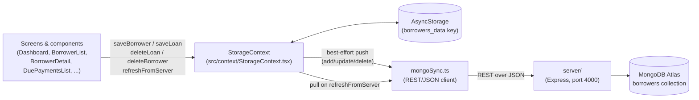

# Architecture

This document describes the module boundaries of the SimpleInterestCalculator
Expo app and how data moves between them. It reflects the code as it exists
today — cross-reference file paths below if you're navigating the repo for
the first time.

## Module map

```
index.ts                        Expo entry point (registerRootComponent)
App.tsx                         Root shell: sidebar nav + screen switch, reads
                                 expo.extra.mongoApiUrl into globalThis
src/navigation/screens.ts       Screen union type + sidebar nav item metadata
src/screens/                    Full-page views wired into the screen switch
src/components/                 Reusable UI widgets shared across screens
src/context/StorageContext.tsx  Single source of truth for borrower/loan state
src/hooks/useStorage.ts         Deprecated alias for useStorageContext()
src/hooks/useNotifications.ts   No-op stub (reminders not implemented yet)
src/services/mongoSync.ts       HTTP client for the server/ Express API (active)
src/services/sheetsSync.ts      HTTP client for the old Apps Script webapp (legacy, unused)
src/utils/                      Pure helper functions (no React, no I/O)
server/                         Express + MongoDB REST API (see note below)
proxy/sheets_proxy.py           Legacy Flask CORS relay for Sheets (unused, see note)
docs/GOOGLE_SHEETS_APPS_SCRIPT.md  Legacy Apps Script contract (kept for reference)
docs/NOSQL_MIGRATION_PROPOSAL.md   Why MongoDB was chosen and how it's wired in
testing.js                      Legacy: exercises the old Apps Script webapp directly
```

## Layers and responsibilities

### Navigation (`src/navigation/screens.ts`, `App.tsx`, `src/components/Sidebar.tsx`)

`App.tsx` owns a single `screen: Screen` state value (`'dashboard' | 'due' |
'simple' | 'emi' | 'clients'`) and renders one top-level component per screen.
There is no navigation library — `Sidebar` is an animated overlay that calls
back into `App.tsx` via `onSelect`. `src/navigation/screens.ts` is the single
place that lists the five screens, their icons, and their subtitles, so the
sidebar and the top bar stay in sync.

### Screens (`src/screens/*.tsx`) and components (`src/components/*.tsx`)

Screen-level components (`Dashboard`, `DuePaymentsList`,
`SimpleInterestCalculator`, `EmiCalculator`, `BorrowerList`, `BorrowerDetail`
— in `src/screens/`) read from `useStorageContext()` (or the `useStorage()`
alias) and render one of the five screens. `BorrowerList` internally swaps
between the list, `BorrowerForm` (create/edit), and `BorrowerDetail`
(profile + loans) without a router — plain `useState`.

Reusable widgets (`DatePicker`, `ShareResultCard`, `RefreshButton`,
`PaymentRecorder`, `BorrowerForm`, `Sidebar` — in `src/components/`) are
shared across screens and hold no borrower state of their own; they take
data in via props and report changes via callbacks.

`SimpleInterestCalculator.tsx` and `EmiCalculator.tsx` are self-contained —
they compute results locally (simple interest / EMI schedule math) and never
touch `StorageContext` or the API sync, since calculator results aren't
persisted.

### State management (`src/context/StorageContext.tsx`)

`StorageProvider` is mounted once in `App.tsx` and is the only component that
talks to `AsyncStorage` directly. It holds the in-memory `borrowers: Borrower[]`
array and exposes CRUD + sync operations through `useStorageContext()`:

- `saveBorrower` / `saveLoan` — persist to AsyncStorage first, then attempt a
  best-effort push to the API server (failures are logged and swallowed, not
  surfaced to the UI — the local write already succeeded).
- `deleteLoan` / `deleteBorrower` — same local-first, sync-best-effort pattern.
  `deleteLoan` also drops the borrower entirely once their last loan is removed
  (both locally and, per the server's own rule, in MongoDB).
- `refreshFromServer` — the only *pull* operation; it fetches the full
  dataset from the API server and overwrites both in-memory state and
  AsyncStorage. Returns a discriminated `RefreshResult` so callers
  (`RefreshButton`) can show a specific error instead of a generic failure.
- `getBorrower` — synchronous lookup against the in-memory array.

`src/hooks/useStorage.ts` is a thin, deprecated wrapper around
`useStorageContext()` kept for components that were written before the
context existed; both are used interchangeably across `src/screens/` and
`src/components/`.

Every write goes through `StorageContext` — `BorrowerForm.tsx`,
`BorrowerDetail.tsx`, and `DuePaymentsList.tsx` previously also called
`sheetsSync.postToSheet()` directly with ad hoc payloads outside of
`StorageContext`'s own sync calls; those ad hoc calls were removed during
the MongoDB migration (they were redundant with the `saveBorrower`/
`deleteLoan` calls already made right next to them) so there's now exactly
one write path.

### Services / sync layer (`src/services/mongoSync.ts`)

A stateless HTTP client for the `server/` Express API: one `fetch` call per
operation, plain JSON over REST (no URL-length workaround needed, unlike the
old Sheets integration, since requests go straight to a server you control
instead of through Google Apps Script's GET-only redirect quirk).

`mongoSync` exports one function per operation (`fetchAllData`,
`fetchAllBorrowers`, `fetchLoan`, `addLoan`, `updateLoanInfo`,
`updateBorrowerInfo`, `writePaymentSchedule`, `updatePayment`, `deleteLoan`,
`deleteBorrower`) matching `server/src/routes.js`'s routes 1:1.

### The API server (`server/`)

An Express app (`server/src/index.js`) that connects to MongoDB Atlas via
the official `mongodb` driver (`server/src/db.js`, reading `MONGODB_URI`
from `server/.env`) and exposes REST routes (`server/src/routes.js`) that
read/write one `borrowers` collection — each document embeds its `loans`,
each loan embeds its `payments`, mirroring the app's own nested types
exactly. It's a separate Node process you run yourself (`cd server && npm
start`), the same way `proxy/sheets_proxy.py` was a separate Python process
— see [the README's setup section](../README.md#mongodb-atlas--api-server-setup).

### Legacy: `src/services/sheetsSync.ts` and `proxy/sheets_proxy.py`

Both remain in the repo but **are no longer called from anywhere in the
app**. `sheetsSync.ts` was a stateless HTTP client for a Google Apps Script
web app (GET requests with the JSON payload URL-encoded into a `?payload=`
query param — a workaround for how Apps Script's redirect-echo behavior
only replays real output on GET, documented in the file's header comment).
`sheets_proxy.py` was a Flask relay that forwarded POST requests to that
Apps Script URL with permissive CORS headers; it was already unwired before
the MongoDB migration. See
[docs/NOSQL_MIGRATION_PROPOSAL.md](./NOSQL_MIGRATION_PROPOSAL.md) for why
Sheets was replaced, and
[docs/GOOGLE_SHEETS_APPS_SCRIPT.md](./GOOGLE_SHEETS_APPS_SCRIPT.md) for the
Apps Script contract if you ever need to reference it.

### Hooks (`src/hooks/`)

- `useStorage.ts` — deprecated alias for `useStorageContext()`.
- `useNotifications.ts` — stub returning no-op async functions
  (`scheduleRemindersForBorrower`, `cancelRemindersForBorrower`). Components
  already call these at the right points (loan save/delete, payment record),
  so wiring in real local notifications later only requires implementing
  this hook.

### Utils (`src/utils/`)

Pure functions, no React or I/O:

- `duePayments.ts` — `getAmountDue`, `isPaymentOverdue`, `getDuePayments`.
  Used by `Dashboard`, `DuePaymentsList`, `PaymentRecorder`, and
  `portfolioMetrics.ts`.
- `portfolioMetrics.ts` — `computePortfolioMetrics`, aggregates exposure,
  outstanding/collected totals, and overdue stats for the Dashboard screen.
- `format.ts` — currency/date string formatting shared across screens.

## Data flow



Reads and writes are both **local-first**: every mutation updates
AsyncStorage (and in-memory state) before attempting a sync to the API
server, and a failed sync is caught, logged with `console.warn`, and never
rolled back or surfaced as an error to the user — the assumption is that
server sync is a convenience layer, and the phone's local copy is the
durable source of truth between sessions. The only way stale local data
gets corrected from the server is the explicit pull via `refreshFromServer`
(the "Refresh" button), which overwrites local state wholesale.

## Screens at a glance

| Screen key | Component | Reads | Writes |
|---|---|---|---|
| `dashboard` | `Dashboard` | `borrowers` (via `computePortfolioMetrics`) | — (refresh only) |
| `due` | `DuePaymentsList` | `borrowers` (via `getDuePayments`) | `saveBorrower` |
| `simple` | `SimpleInterestCalculator` | local component state only | none (not persisted) |
| `emi` | `EmiCalculator` | local component state only | none (not persisted) |
| `clients` | `BorrowerList` → `BorrowerForm` / `BorrowerDetail` | `borrowers` | `saveBorrower`, `deleteBorrower`, `deleteLoan` |
