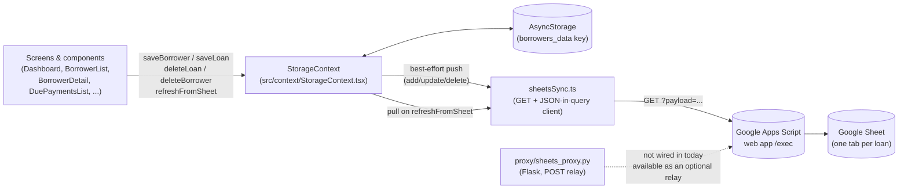

# Architecture

This document describes the module boundaries of the SimpleInterestCalculator
Expo app and how data moves between them. It reflects the code as it exists
today — cross-reference file paths below if you're navigating the repo for
the first time.

## Module map

```
index.ts                        Expo entry point (registerRootComponent)
App.tsx                         Root shell: sidebar nav + screen switch, reads
                                 expo.extra.sheetsWebappUrl into globalThis
src/navigation/screens.ts       Screen union type + sidebar nav item metadata
src/screens/                    Full-page views wired into the screen switch
src/components/                 Reusable UI widgets shared across screens
src/context/StorageContext.tsx  Single source of truth for borrower/loan state
src/hooks/useStorage.ts         Deprecated alias for useStorageContext()
src/hooks/useNotifications.ts   No-op stub (reminders not implemented yet)
src/services/sheetsSync.ts      HTTP client for the Google Apps Script webapp
src/utils/                      Pure helper functions (no React, no I/O)
proxy/sheets_proxy.py           Standalone Flask CORS relay (see note below)
docs/GOOGLE_SHEETS_APPS_SCRIPT.md  Server-side (Apps Script) contract
testing.js                      Node script that exercises the deployed
                                 Apps Script webapp directly, bypassing the app
```

## Layers and responsibilities

### Navigation (`src/navigation/screens.ts`, `App.tsx`, `src/components/Sidebar.tsx`)

`App.tsx` owns a single `screen: Screen` state value (`'dashboard' | 'due' |
'simple' | 'emi' | 'clients'`) and renders one top-level component per screen.
There is no navigation library — `Sidebar` is an animated overlay that calls
back into `App.tsx` via `onSelect`. `src/navigation/screens.ts` is the single
place that lists the five screens, their icons, and their subtitles, so the
sidebar and the top bar stay in sync.

### Screens (`src/screens/*.tsx`) and components (`src/components/*.tsx`)

Screen-level components (`Dashboard`, `DuePaymentsList`,
`SimpleInterestCalculator`, `EmiCalculator`, `BorrowerList`, `BorrowerDetail`
— in `src/screens/`) read from `useStorageContext()` (or the `useStorage()`
alias) and render one of the five screens. `BorrowerList` internally swaps
between the list, `BorrowerForm` (create/edit), and `BorrowerDetail`
(profile + loans) without a router — plain `useState`.

Reusable widgets (`DatePicker`, `ShareResultCard`, `RefreshButton`,
`PaymentRecorder`, `BorrowerForm`, `Sidebar` — in `src/components/`) are
shared across screens and hold no borrower state of their own; they take
data in via props and report changes via callbacks.

`SimpleInterestCalculator.tsx` and `EmiCalculator.tsx` are self-contained —
they compute results locally (simple interest / EMI schedule math) and never
touch `StorageContext` or Sheets sync, since calculator results aren't
persisted.

### State management (`src/context/StorageContext.tsx`)

`StorageProvider` is mounted once in `App.tsx` and is the only component that
talks to `AsyncStorage` directly. It holds the in-memory `borrowers: Borrower[]`
array and exposes CRUD + sync operations through `useStorageContext()`:

- `saveBorrower` / `saveLoan` — persist to AsyncStorage first, then attempt a
  best-effort push to Google Sheets (failures are logged and swallowed, not
  surfaced to the UI — the local write already succeeded).
- `deleteLoan` / `deleteBorrower` — same local-first, sync-best-effort pattern.
  `deleteLoan` also drops the borrower entirely once their last loan is removed.
- `refreshFromSheet` — the only *pull* operation; it fetches the full dataset
  from Sheets and overwrites both in-memory state and AsyncStorage. Returns a
  discriminated `RefreshResult` so callers (`RefreshButton`) can show a
  specific error instead of a generic failure.
- `getBorrower` — synchronous lookup against the in-memory array.

`src/hooks/useStorage.ts` is a thin, deprecated wrapper around
`useStorageContext()` kept for components that were written before the
context existed; both are used interchangeably across `src/screens/` and
`src/components/`.

A few components (`BorrowerForm.tsx`, `BorrowerDetail.tsx`,
`DuePaymentsList.tsx`) additionally call `sheetsSync.postToSheet()` directly
with ad hoc `{ type: 'add_borrower' | 'update_borrower', payload }` requests,
*outside* of `StorageContext`'s own sync calls. This is existing behavior,
not a bug introduced by this doc — worth knowing if you're debugging
duplicate or unexpected Sheets writes.

### Services / sync layer (`src/services/sheetsSync.ts`)

A stateless HTTP client for one Google Apps Script web app. Every function
sends the same shape: a GET request whose entire JSON payload is
URL-encoded into a single `?payload=` query parameter — **not** a POST body.
This is deliberate (see the file-level comment in `sheetsSync.ts` and in
`proxy/sheets_proxy.py`): Apps Script's `/exec` endpoint 302-redirects to a
`script.googleusercontent.com` echo URL, and that redirect only re-runs your
script if the client follows it with GET. Because GET URLs cap out around
~2000 characters, `writePaymentSchedule` chunks large payment schedules into
multiple requests (first chunk clears the sheet, later chunks append).

`sheetsSync` exports one function per operation (`fetchAllData`, `addLoan`,
`updateLoanInfo`, `updateBorrowerInfo`, `writePaymentSchedule`,
`updatePayment`, `deleteLoan`, `deleteBorrower`, ...) plus a generic
`postToSheet` escape hatch used by the ad hoc call sites mentioned above.
The full list of `type` values sent to the Apps Script and the expected
response shape are documented in
[`docs/GOOGLE_SHEETS_APPS_SCRIPT.md`](./GOOGLE_SHEETS_APPS_SCRIPT.md).

### The Python proxy (`proxy/sheets_proxy.py`)

A minimal Flask app (`proxy()` route) that accepts a POST at `/`, forwards
the raw body to `APPS_SCRIPT_URL` as a POST, and relays the response back
with permissive CORS headers. **It is not currently called from any code
path in the Expo app** — `sheetsSync.ts` talks to the Apps Script URL
directly via GET, and nothing in `src/screens/`, `src/components/`,
`src/context/`, or `src/hooks/` references `localhost`, a proxy port, or
this file. Treat it as an optional,
separately-run relay you can put in front of Apps Script (for example, if
you need POST semantics, want to hide the Apps Script URL from the client
bundle, or want to add your own auth/rate-limiting) rather than a required
part of the current data flow.

### Hooks (`src/hooks/`)

- `useStorage.ts` — deprecated alias for `useStorageContext()`.
- `useNotifications.ts` — stub returning no-op async functions
  (`scheduleRemindersForBorrower`, `cancelRemindersForBorrower`). Components
  already call these at the right points (loan save/delete, payment record),
  so wiring in real local notifications later only requires implementing
  this hook.

### Utils (`src/utils/`)

Pure functions, no React or I/O:

- `duePayments.ts` — `getAmountDue`, `isPaymentOverdue`, `getDuePayments`.
  Used by `Dashboard`, `DuePaymentsList`, `PaymentRecorder`, and
  `portfolioMetrics.ts`.
- `portfolioMetrics.ts` — `computePortfolioMetrics`, aggregates exposure,
  outstanding/collected totals, and overdue stats for the Dashboard screen.
- `format.ts` — currency/date string formatting shared across screens.

## Data flow



Reads and writes are both **local-first**: every mutation updates
AsyncStorage (and in-memory state) before attempting a Sheets sync, and a
failed sync is caught, logged with `console.warn`, and never rolled back or
surfaced as an error to the user — the assumption is that Sheets sync is a
convenience layer, and the phone's local copy is the durable source of truth
between sessions. The only way stale local data gets corrected from Sheets
is the explicit pull via `refreshFromSheet` (the "Refresh Sheets" button),
which overwrites local state wholesale.

## Screens at a glance

| Screen key | Component | Reads | Writes |
|---|---|---|---|
| `dashboard` | `Dashboard` | `borrowers` (via `computePortfolioMetrics`) | — (refresh only) |
| `due` | `DuePaymentsList` | `borrowers` (via `getDuePayments`) | `saveBorrower`, ad hoc `update_borrower` push |
| `simple` | `SimpleInterestCalculator` | local component state only | none (not persisted) |
| `emi` | `EmiCalculator` | local component state only | none (not persisted) |
| `clients` | `BorrowerList` → `BorrowerForm` / `BorrowerDetail` | `borrowers` | `saveBorrower`, `deleteBorrower`, `deleteLoan`, ad hoc `add_borrower`/`update_borrower` pushes |
